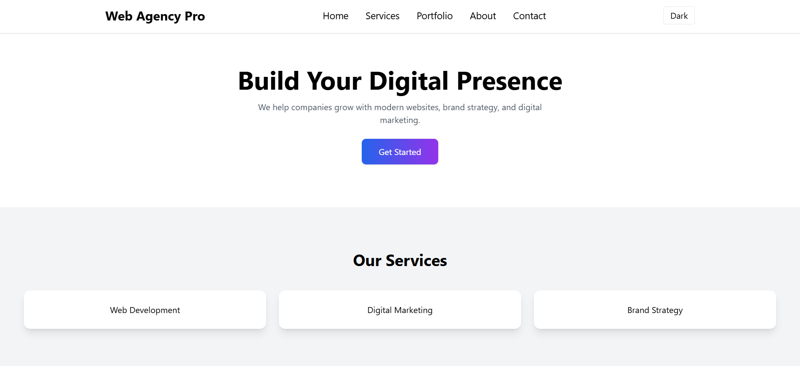
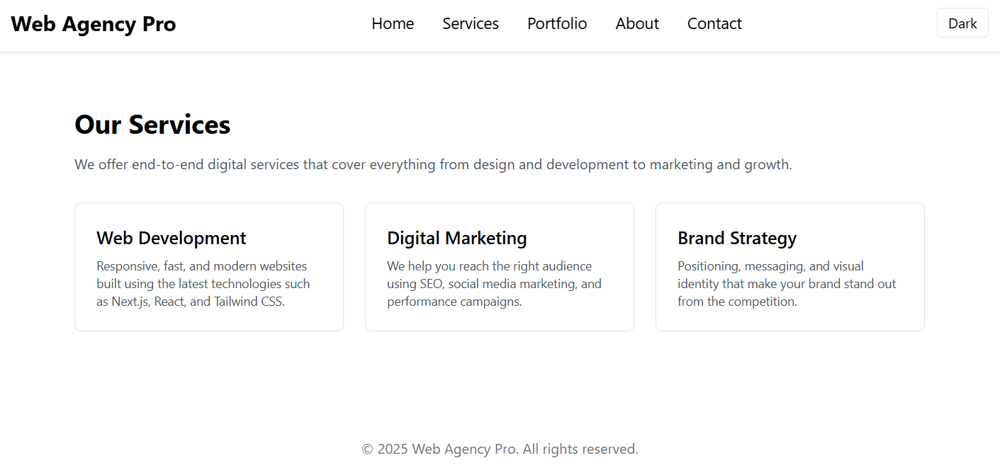
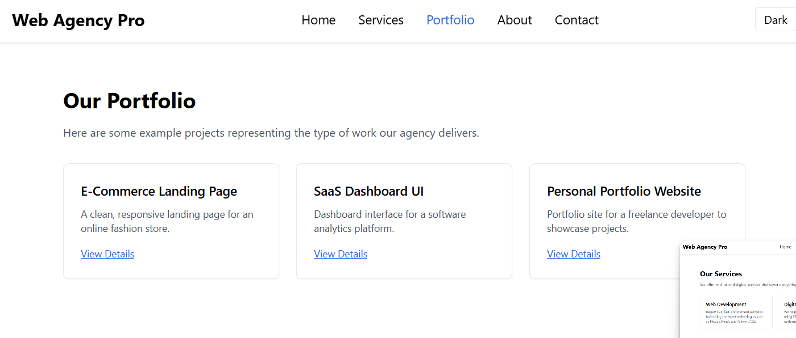
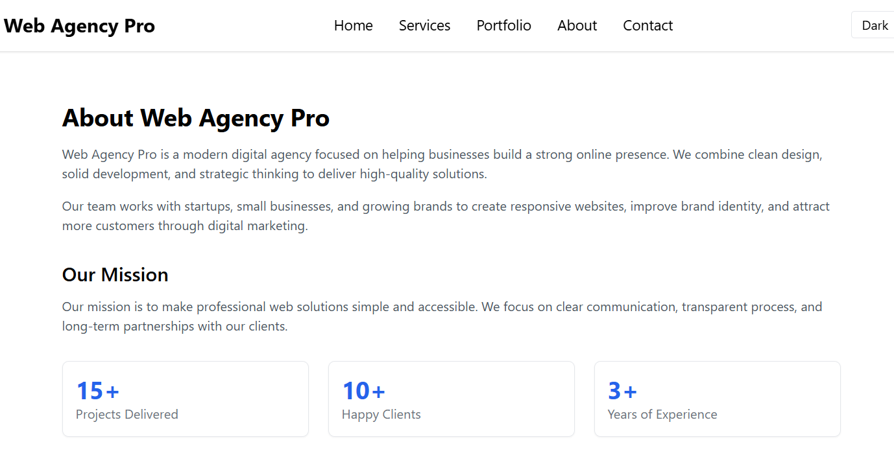
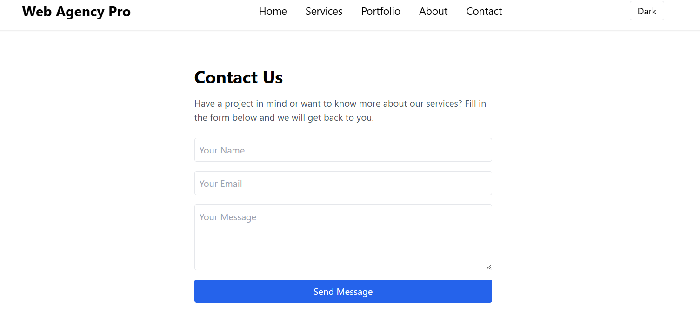
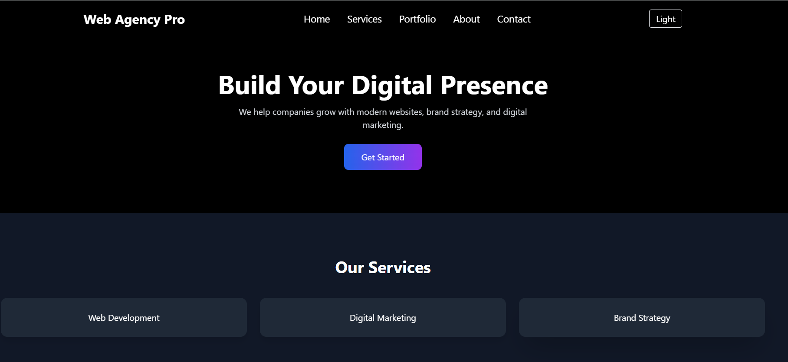

📄 README.md — Web Agency Pro
# 🌐 Web Agency Pro  
A modern, fully responsive business landing website built using **Next.js**, **Tailwind CSS**, and **Framer Motion**.  
This project is designed as a professional digital agency landing page with multiple sections and pages.

---

## 🚀 Features

### ✅ Multi-Page Website
- Home  
- Services  
- Portfolio  
- About  
- Contact  

### ✅ Modern UI/UX
- Clean & professional layout  
- Beautiful typography  
- Gradient buttons  
- Card hover effects  
- Soft shadows  

### ✅ Animations
- Hero section fade-in animations  
- Services card reveal animations  

### ✅ Dark Mode Support
- One-click toggle in navbar  
- Fully responsive design in both light & dark themes  

### ✅ Fully Responsive
- Mobile-friendly  
- Tablet-friendly  
- Desktop-friendly  

### ✅ Contact Form
- Frontend form validation  
- Shows success message  
- Can be connected to backend/email later  

---

## 🛠️ Technologies Used

| Technology     | Purpose                          |
|----------------|----------------------------------|
| **Next.js**    | React framework & routing        |
| **React**      | Component-based UI               |
| **Tailwind CSS** | Styling & responsiveness       |
| **Framer Motion** | Animations                    |
| **TypeScript (optional)** | Type-safe development |
| **npm**        | Package manager                  |

---

## 📁 Folder Structure

web-agency-pro/
│
├── app/ # Next.js App Router pages
│ ├── page.tsx # Homepage
│ ├── about/ # About Page
│ ├── services/ # Services Page
│ ├── portfolio/ # Portfolio Page
│ └── contact/ # Contact Page
│
├── components/
│ ├── Navbar.tsx # Header with dark mode toggle
│ ├── Hero.tsx # Hero banner with animation
│ ├── Features.tsx # Services section
│ └── Footer.tsx # Footer
│
├── public/ # Static assets (images)
├── styles/ # Global styles
├── package.json
└── tailwind.config.js

---

## 🧩 How to Run This Project Locally

2️⃣ Install Dependencies
npm install

3️⃣ Start Development Server
npm run dev

4️⃣ Open in Browser

Go to:

👉  http://localhost:3001

🎥 Live Demo Video (For Assignment)

The demo includes:

1.Running npm run dev

2.Showing homepage & hero section

3.Navigating between pages

4.Showing services, portfolio, contact form

5.ark mode toggle

6.Responsive layout on mobile view

7.Submitting the contact form

🧾 Project Description (Summary)

Web Agency Pro is a business landing website built for assignments, portfolios, or real client projects. It demonstrates:

Next.js routing

Reusable components

Clean UI/UX design

Animations using Framer Motion

Fully responsive pages

Dark/light mode

Simple contact form

This project can be expanded to include blogs, admin panels, or real backend integration.

📌 Future Improvements

Connect contact form to email service (Nodemailer, Resend)

Add testimonial section

Add pricing plans

Add CMS integration (Sanity, Contentful)

Add blog section

🧑‍💻 Author

Aditya Lokhande
Web Developer | Next.js | Frontend Engineering
---

## 📸 Screenshots

### 🏠 Home Page

### 💼 Services Page

### 🖼 Portfolio Page

### ℹ About Page

### 📞 Contact Page

### 🌙 Dark Mode

### 📱 Project / Mobile View

